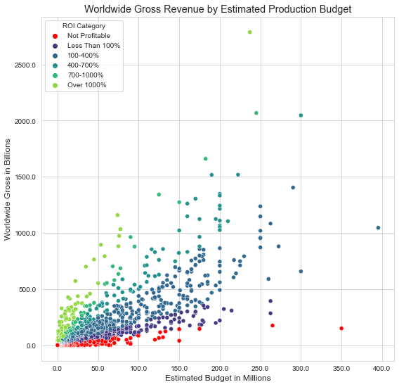

# Phase 1 Project

This repo is a collection of notebooks and resources used to conduct descriptive statistics for the following project.

## Business Problem

* Global Box Office Revenue hit a new record in 2019 at $42.5 billion and has been growing every year
* Netflix is reported to invest $15 billion on new content; Prime Video and Apple TV+ at $6 billion; Hulu, Disney+ and HBO Max are all   coming in around $3 billion
* Enable Microsoft to join the media industry as a production company and grow shareholder value
* Determine features of successful theatrical movie releases to guide Microsoft in producing films that will generate profit

## The Data

In the folder `zippedData` are movie datasets from:

* [Box Office Mojo](https://www.boxofficemojo.com/)
* [IMDB](https://www.imdb.com/)
* [Rotten Tomatoes](https://www.rottentomatoes.com/)
* [TheMovieDB](https://www.themoviedb.org/)
* [The Numbers](https://www.the-numbers.com/)

From these files, all were unzipped into dataFiles. The following tables were used to build a dataset, saved in dataFiles as movie_collection.
* imdb.title.basics
* imdb.title.ratings
* imdb.title.principals
* tmdb.movies
* tn.movie_budgets

Additional data, including the IDMb unique identifier (found in the data as tconst), was added to the tmdb.movies data table by using the id column, which is a unique identifier for their database, to query the TMDb API. A tconst was assigned to all movies in the TN dataset, whereupon other information was assigned to each record from the listed IMDb tables.

These two tables were then concatenated and duplicates removed, resulting in a collection of ~2370 movies with fields:
> 'tconst', 'Title', 'Genres', 'runtime_minutes', 'vote_average','vote_count', 'budget_est', 'worldwide_gross', 'release_week_day',
> 'release_day', 'release_month', 'release_year'

## The Questions

### How much should Microsoft spend?

Except for budgets less than ~20mil, return on investment trends upward with increased budget. So, what subset of movie data should we look at for patterns?

There are many movies that weren't profitable, and many of the extremely high return movies had an extremely low budget, such that there net profit would be the same or lower than for movies with a lower return percentage but higher starting budget. As there is also less movies in the highest budget categories, we will look at the middle of our distribution, with ROI percents between 100 and 700 and with budgets between $10 and $100 million.

### How should the production budget be invested?

Though ROI's are similarly distributed between movie genres in our sample, the Thriller movie category does beat out the others and has some additional advantages.

We can infer from the above graphs that Thriller production could be a good niche to break into, getting consistent returns without having to worry about production quality, meaning less can be spent on big name cast and crew members and there will be less competing releases.

### When should the film be released?

Looking at the above two graphs, we can see that a decision to release in the early summer months leads to the greatest ceiling for both Worldwide Gross and ROI.

Finally, we see that a release on Tuesday will likely generate the highest return for our movie's release.

## Summary

### Our Conclusions

* In general, spending more on production will increase the return on the original investment, but based on our dataset, it is recommended to spend between $10 million and $100 million
* Of the different movie genres, Thriller movies are least often produced but tend to yield the highest ROI. Additionally, ROI may be less affected by production quality, decreasing production budget
* To maximize availability on theatrical release, release movies on a Tuesday evening in one of the early summer months

### For Future Research

* These datasets and analysis only investigates returns based on reported worldwide box office gross numbers and estimated production budgets. The theatrical release of a blockbuster film does not account for a majority of movie-related income; there is home entertainment sales (DVDs), Video on Demand and Streaming Services, Television airtime,  and merchandising. On the other hand, costs related to these are also not explored; manufacturing DVDs and merchandise, deals with streaming service providers and television providers, etc. Similarly, ROI’s presented here have the potential to be hugely overinflated because it is unclear exactly what is included in the production budget estimate. It may be that marketing and other costs related solely to the theatrical release have not been accounted for.
* We primarily looked at a subset of our movie collection where we required movies to make a profit (have ROI > 0). In the future, we can double check that the described features hold true only for profitable movies, increasing our confidence
* We have access to data connecting movie cast and crew to IMDb ID’s which we have for every movie in our collection dataset. While for Thrillers it may not be as important, it may be that there are a subset of the production crew that is a better predictor of high return movies
* As it relates to the first concern, the pandemic, and the rise of streaming services.. Is theatrical release worth it as a new production company with plenty of capital?

